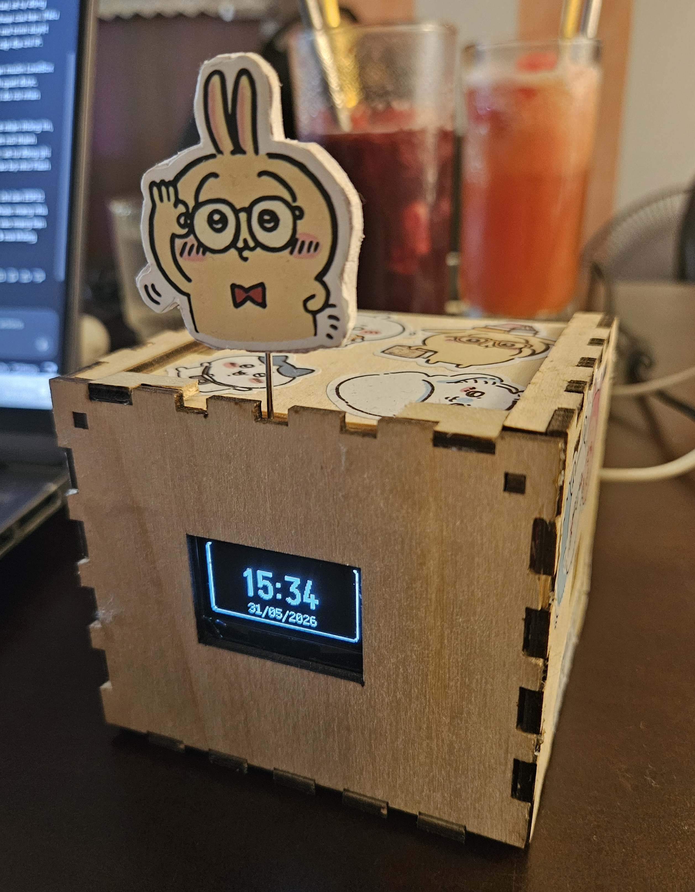
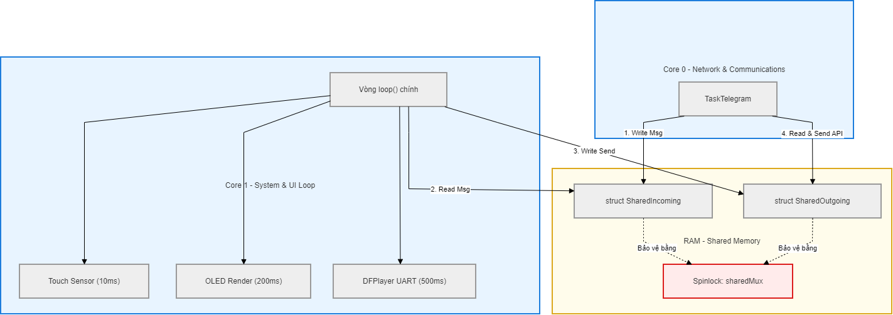
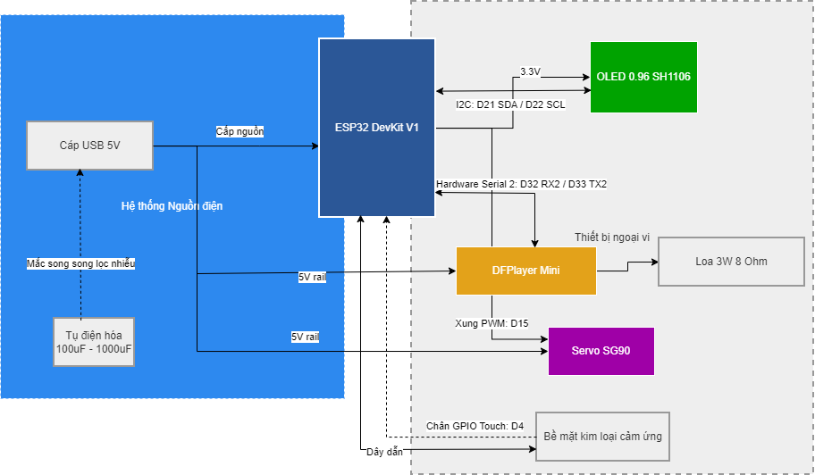

# LoveBox - IoT Smart Messaging Device

[](https://www.espressif.com/en/products/socs/esp32)
[](https://www.arduino.cc/en/software)
[](https://cplusplus.com/)
[](https://opensource.org/licenses/MIT)
[](https://github.com/hieupham03/Message_Box/actions/workflows/compile.yml)
[](https://youtu.be/AbFyEEcto_E)



**LoveBox** là một thiết bị IoT thông minh được thiết kế đặc biệt như một món quà công nghệ dành cho các cặp đôi. Không chỉ là một chiếc hộp nhận tin nhắn theo thời gian thực, LoveBox còn đóng vai trò như một người bạn đồng hành với các tính năng đếm ngày kỷ niệm, nhắc nhở công việc, phát nhạc tự động và một số tương tác thông minh khác.

Dự án được phát triển trên nền tảng vi điều khiển **ESP32**, tận dụng tối đa kiến trúc Dual-Core nhằm duy trì kết nối mạng ổn định đồng thời đảm bảo hiệu suất mượt mà cho giao diện người dùng (UI) và phần cứng âm thanh.

---

### Video Demo Hoạt Động
Bạn có thể xem video trình diễn thực tế của thiết bị, mô tả chi tiết các phân cảnh hoạt động, phản hồi xúc giác và các tích hợp thông minh khác trực tiếp tại YouTube:

[](https://youtu.be/AbFyEEcto_E)

---

## Tính năng nổi bật & Cách thức hoạt động

### 1. Kết nối & Tương tác thông minh
* **Nhận tin nhắn Real-time:** Tích hợp Telegram Bot và nền tảng Blynk, hiển thị tin nhắn tức thời lên màn hình OLED.
  * *Chi tiết triển khai:* ESP32 liên tục lắng nghe webhook từ nền tảng IoT Blynk và polling thư viện `UniversalTelegramBot`. Khi có tin nhắn mới, dữ liệu được parse và đẩy sang luồng hiển thị (Core 1) để vẽ lên màn hình OLED.
* **Chatbot Telegram:** Hỗ trợ nhận lệnh điều khiển từ xa.
  * *Chi tiết triển khai:* Parse các tin nhắn bắt đầu bằng ký tự `/` (như `/status` để kiểm tra trạng thái, `/pomodoro` để bật đếm giờ). Code C++ xử lý logic tương ứng và gọi API của Telegram gửi câu trả lời về lại Chat ID của người dùng.
* **Thú cưng ảo (Virtual Pet) kết hợp AI:** Hiển thị thông điệp và biểu cảm động của thú cưng trên màn hình. Đặc biệt, hệ thống được thiết lập để trả lời prompt như một AI Assistant.
  * *Chi tiết triển khai:* Sử dụng **Make.com** (Integromat) làm trung gian. Make.com nhận prompt từ một nguồn (như Telegram/Discord), gửi qua API của AI (ChatGPT/Gemini) để sinh ra lời nhắn hoặc câu trả lời. Sau đó, Make.com tự động gọi HTTP GET/POST tới API của Blynk (chân ảo V9) để bắn đoạn text đó xuống ESP32. ESP32 nhận dữ liệu, kích hoạt trạng thái `isShowingPet`, bật giao diện thú cưng đang nói chuyện lên OLED và gõ Servo báo hiệu.
* **Cảm ứng điện dung siêu nhạy:** Nhận diện lệnh bằng cách chạm vào vỏ hộp.
  * *Chi tiết triển khai:* Sử dụng chân cảm ứng phần cứng (Touch0 - GPIO4) của ESP32 nối với một bề mặt kim loại. Thuật toán phần mềm liên tục lấy mẫu (sampling), dùng bộ lọc nhiễu và hàm `millis()` đo thời gian để phân biệt giữa chạm đơn (Single Tap), chạm đúp (Double Tap) và chạm giữ (Hold).
* **Phản hồi xúc giác (Haptic Feedback):** Âm thanh báo hiệu vật lý.
  * *Chi tiết triển khai:* Gắn Servo SG90 bên trong hộp. Khi có sự kiện (tin nhắn, báo thức), ESP32 cấp xung PWM để servo quay một góc nhỏ gõ cộc cộc vào vỏ hộp, tạo cảm giác có người gõ cửa rất chân thực.

### 2. Tiện ích & Giải trí
* **Music Player:** Phát danh sách 100 bài hát với chế độ phát ngẫu nhiên (Shuffle) mượt mà.
  * *Chi tiết triển khai:* Giao tiếp chuẩn UART với module âm thanh DFPlayer Mini. Thuật toán Shuffle được viết tay bằng C++: khởi tạo một mảng chứa ID từ 1 đến 100, sau đó dùng thuật toán tráo đổi vị trí ngẫu nhiên (`random()`) để tạo ra một playlist không bị trùng lặp.
* **Pomodoro Timer:** Bộ đếm thời gian tập trung 25 phút.
  * *Chi tiết triển khai:* Khi kích hoạt, biến trạng thái `isPomodoro` được bật. ESP32 gửi lệnh qua UART để tạm dừng nhạc, bắt đầu đếm ngược 25 phút bằng `millis()`, đồng bộ trạng thái lên app Blynk và rung chuông báo thức khi hoàn thành.
* **Đồng hồ & Báo thức:** Đồng bộ thời gian thực chuẩn xác.
  * *Chi tiết triển khai:* Kết nối với máy chủ thời gian `time.google.com` qua giao thức NTP. Sử dụng thư viện `time.h` mặc định của C++ để phân tích timestamp thành giờ, phút, giây và render lên màn hình. Tính năng báo thức so sánh giờ hệ thống với giờ do người dùng cấu hình qua giao diện chọn giờ của Blynk.

### 3. Kiến trúc hệ thống (Core System)
* **Dual-Core Multitasking:** Xử lý đa luồng độc lập, chống giật lag.
  * *Chi tiết triển khai:* Ứng dụng hệ điều hành FreeRTOS (`xTaskCreatePinnedToCore`) tích hợp sẵn trong ESP32. Core 0 chạy một Task vô hạn để lo xử lý mạng (WiFi, Blynk, Telegram) vốn tốn nhiều thời gian chờ. Trong khi đó, Core 1 chạy vòng `loop()` liên tục xử lý render đồ họa U8g2, lấy mẫu Touch và quét trạng thái âm thanh để đảm bảo tốc độ phản hồi tính bằng mili-giây.

  
* **Smart WiFi Setup & Auto Fallback:** Kết nối WiFi thông minh, dự phòng sự cố.
  * *Chi tiết triển khai:* Cấu hình ESP32 kết nối tuần tự với các SSID lưu cứng (VD: mạng nhà bạn trai, mạng nhà bạn gái). Nếu đều thất bại, thiết bị dùng thư viện `WiFiManager` chuyển sang chế độ Access Point, phát ra một WiFi tên `LoveBox Setup`. Người dùng kết nối vào WiFi này, thiết bị sẽ bật một trang web Captive Portal nội bộ để người dùng chọn mạng và điền mật khẩu mới.
* **Cập nhật phần mềm không dây (OTA Update):** Nạp code từ xa.
  * *Chi tiết triển khai:* Sử dụng thư viện `ArduinoOTA`. Khởi tạo một cổng lắng nghe tín hiệu upload. Trong Arduino IDE trên máy tính, cổng COM sẽ xuất hiện tên thiết bị qua mạng, cho phép nhấn Upload trực tiếp mà không cần cắm cáp USB vào mạch.
* **Safe Mode & Watchdog (WDT):** Cơ chế tự bảo vệ phần cứng và phần mềm.
  * *Chi tiết triển khai:* Kích hoạt Hardware Watchdog Timer. Nếu code bị vòng lặp vô hạn (treo máy) quá 30 giây, Watchdog sẽ khởi động lại mạch. Biến `crashCount` được lưu trong phân vùng nhớ RTC (không bị xóa khi mất điện tạm thời). Nếu crash liên tục 3 lần, hệ thống đặt cờ `isSafeMode = true`, chặn tất cả kết nối và module ngoại vi để tránh cháy nổ hoặc vòng lặp reset vô hạn.

---

## Yêu cầu phần cứng (Hardware)

* **MCU:** ESP32 DevKit V1
* **Màn hình:** OLED 0.96" (IC SH1106 - Giao tiếp I2C)
* **Âm thanh:** DFRobot DFPlayer Mini + Loa 3W
* **Động cơ:** Servo SG90
* **Cảm biến:** Cảm biến chạm điện dung (Nối trực tiếp qua chân Touch T0 của ESP32)

### Sơ đồ chân (Pinout)

| Linh kiện | Chân trên ESP32 | Ghi chú |
| :--- | :--- | :--- |
| **OLED (SDA/SCL)** | `D21` / `D22` | Giao tiếp I2C tiêu chuẩn |
| **DFPlayer (RX/TX)** | `D33` / `D32` | Serial 2 (Hardware Serial) |
| **Servo SG90** | `D15` | Điều khiển PWM |
| **Touch Sensor** | `D4` | Chân cảm biến điện dung (Touch0) |

### Sơ đồ đi dây phần cứng (Hardware Wiring Diagram)



---

## Cấu trúc dự án

```text
LoveBox/
├── assets/
│   └── images/
│       ├── freertos_arch.png   # Sơ đồ đa nhiệm FreeRTOS
│       ├── hardware_block.png  # Sơ đồ đi dây phần cứng
│       └── image01.jpg         # Ảnh chụp thực tế sản phẩm hoàn thiện
├── docs/
│   └── DIAGRAMS_GUIDE.md   # Hướng dẫn vẽ và mã nguồn các sơ đồ hệ thống
├── src/                    # Thư mục mã nguồn C++ tách module sạch sẽ
│   ├── AudioManager.cpp/h  # Trình phát nhạc MP3 (Fisher-Yates Shuffle)
│   ├── DisplayManager.cpp/h# Điều khiển màn hình OLED SH1106
│   ├── Globals.cpp/h       # Trạng thái hệ thống, cấu hình phần cứng
│   ├── NetworkManager.cpp/h# Core 0: Xử lý WiFi, Blynk, Telegram Bot, NTP, OTA
│   ├── ServoManager.cpp/h  # Phản hồi xúc giác qua Servo SG90
│   └── TouchManager.cpp/h  # Core 1: Lấy mẫu Touch, lọc nhiễu Median & EMA
├── MessageBox.ino          # Điểm khởi đầu chương trình chính
├── README.md               # Tài liệu tổng quan dự án
├── secrets.example.h       # Mẫu cấu hình bảo mật mẫu
└── secrets.h               # Cấu hình bảo mật cá nhân (Được gitignore)
```

---

## Hướng dẫn cài đặt (Installation & Setup)

### Bước 1: Cài đặt thư viện (Arduino IDE)
Sử dụng **Library Manager** trong Arduino IDE để cài đặt các thư viện sau:
* `Blynk` (Giao tiếp IoT)
* `UniversalTelegramBot` (Xử lý tin nhắn Telegram Bot)
* `U8g2` (Điều khiển đồ họa màn hình OLED)
* `ESP32Servo` (Điều khiển động cơ Servo)
* `DFRobotDFPlayerMini` (Giao tiếp module MP3)

### Bước 2: Cấu hình bảo mật (Credentials)
Tạo một file có tên là `secrets.h` đặt cùng cấp với file `MessageBox.ino`. Khai báo các thông tin cá nhân vào file này:

```cpp
#ifndef SECRETS_H
#define SECRETS_H
#pragma once

// 1. Cấu hình WiFi
#define WIFI_SSID     "Tên_WiFi_Của_Bạn"
#define WIFI_PASSWORD "Mật_khẩu_WiFi"

// 2. Cấu hình Blynk (Lấy từ Web Dashboard)
#define SECRET_BLYNK_TEMPLATE_ID    "TMPL_XXX"
#define SECRET_BLYNK_TEMPLATE_NAME  "LoveBox"
#define SECRET_BLYNK_AUTH_TOKEN     "Token_Blynk_Của_Bạn"

// 3. Cấu hình Telegram
#define SECRET_BOT_TOKEN     "Token_BotFather"
#define SECRET_CHAT_ID       "ID_Chat_Của_Bạn"

#endif
```

### Bước 3: Nạp chương trình (Flash to ESP32)
1. Mở file `MessageBox.ino` bằng Arduino IDE.
2. Vào **Tools > Board**, chọn **ESP32 Dev Module**.
3. Chọn cổng COM tương ứng của mạch ESP32.
4. Nhấn **Upload** để tiến hành nạp code.

---

## Giấy phép (License)
Dự án được phân phối dưới giấy phép [MIT License](https://opensource.org/licenses/MIT).
